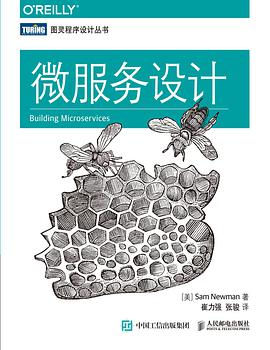

### 微服务设计 (图灵程序设计丛书)

 - 作者: [[英\] 纽曼Sam Newman](https://book.douban.com/search/Sam Newman)
 - 出版社: 人民邮电出版社
 - 译者: [崔力强](https://book.douban.com/search/崔力强) / [张骏](https://book.douban.com/search/张骏)
 - 出版年: 2016-5
 - 阅读时间: 2021-03-31
 - 页数: 228

### 阅读笔记

标注 (黄)和笔记 | 第 2 页

> 微服务就是一些协同工作的小而自治的服务
#### 微服务定义

------

标注 (黄)和笔记 | 第 2 页
> 把因相同原因而变化的东西聚合到一起，而把因不同原因而变化的东西分离开来
#### 单一职责原则(内聚性)

------

标注 (黄)和笔记 | 第 3 页
> 尝试使用一种适合所有场景的标准化技术，会使得所有的场景都无法得到很好的
#### 技术选型建议

------

标注 (黄)和笔记 | 第 11 页
> 架构师的一个重要职责是，确保团队有共同的技术愿景，以帮助我们向客户交付他们想要的系统
#### 架构师职责

------

标注 (黄)和笔记 | 第 13 页
> 架构师必须改变那种从一开始就要设计出完美产品的想法，相反我们应该设计出一个合理的框架，在这个框架下可以慢慢演化出正确的系统，并且一旦我们学到了更多知识，应该可以很容易地应用到系统中
#### 架构师设计理念

------

标注 (黄)和笔记 | 第 13 页
> 架构师的职责之一就是保证该系统适合开发人员在其上工作
#### 架构师职责之一

------

标注 (黄)和笔记 | 第 14 页
> 作为架构师，不应该过多关注每个区域内发生的事情，而应该多关注区域之间的
#### 架构师的视野应该要更广不能只看某一个区域

------

标注 (黄)和笔记 | 第 18 页
> 没有很好处理下游错误请求的服务越多，我们的系统就会越脆弱
#### 接口请求规范

------

标注 (黄)和笔记 | 第 28 页
> 当你在思考组织内的限界上下文时，不应该从共享数据的角度来考虑，而应该从这些上下文能够提供的功能来考虑
#### 微服务限界划分

------

标注 (黄)和笔记 | 第 31 页
> 这种架构称为 洋葱架构，因为它有很多层，而且当纵切这些层次时，我只想哭
#### 说的好

------

标注 (黄)和笔记 | 第 34 页
> 隐藏实现细节非常重要，因为它让我们的服务拥有一定的自治性，从而可以轻易地修改其内部实现。再见，松耦合
#### 隐藏服务内部细节(增加自治性)

------

标注 (黄)和笔记 | 第 36 页
> 编排方式的缺点是，客户服务作为中心控制点承担了太多职责，它会成为网状结构的中心枢纽及很多逻辑的起点。我见过这个方法会导致少量的“上帝”服务，而与其打交道的那些服务通常都会沦为贫血的、基于 CRUD 的服务
#### 避免让一个服务承担太多职责导致出现'上帝'服务，想想自己的项目中有出现这样的情况嘛

------

标注 (黄)和笔记 | 第 38 页
> 有一些 RPC 机制，如 Java RMI，与特定的平台紧密绑定，这对于服务端和客户端的技术选型造成了一定限制
#### RPC 机制缺点

------

标注 (黄)和笔记 | 第 39 页
> RPC 的核心想法是隐藏远程调用的的复杂性
#### RPC是一种API，HTTP是一种无状态的网络协议；HTTP是基于应用层协议，而RPC主要是基于TCP/IP协议，因为HTTP协议是在传输层协议TCP之上的，所以效率来看的话，RPC当然是要更胜一筹啦

------

标注 (黄)和笔记 | 第 46 页
> 尽量让中间件保持简单，而把业务逻辑放在自己的服务
#### 不要过分的把业务和中间件绑在一起

------

标注 (黄)和笔记 | 第 48 页
> 响应式扩展（Reactive extensions，Rx）提供了一种机制，在此之上，你可以把多个调用的结果组装起来并在此基础上执行操作
#### 响应式扩展

------

标注 (黄)和笔记 | 第 50 页
> 它遵守了一个原则，即客户服务应该是关于客户信息的唯一可靠来源
#### 服务高内聚

------

标注 (黄)和笔记 | 第 52 页
> 系统中的每个模块都应该“宽进严出”，即对自己发送的东西要严格，对接收的东西则要宽容
#### 鲁棒性原则

------

标注 (黄)和笔记 | 第 53 页
> 语义化版本管理的每一个版本号都遵循这样的格式： MAJOR.MINOR.PATCH。其中 MAJOR 的改变意味着其中包含向后不兼容的修改； MINOR 的改变意味着有新功能的增加，但应该是向后兼容的；最后， PATCH 的改变代表对已有功能的缺陷修复
#### 语义化版本管理，想想可以用在很多地方比如git的tag

------

标注 (黄)和笔记 | 第 55 页
> 升级消费者到新版本的时间越长，就越应该考虑在同一个微服务中暴露两套 API 的做法
#### 保持高可用的服务版本管理

------

标注 (黄)和笔记 | 第 60 页
> 保证一个这样的后端只为一个应用或者用户界面服务
#### "每个端都对应各自的适配器服务BFF(Backends For Frontends

------

标注 (黄)和笔记 | 第 60 页
> 这些 BFF 应该仅仅包含与实现某种特定的用户体验相关的
#### BFF 为前端服务的后端，为每一个视图端都提供最合适的服务

------

标注 (黄)和笔记 | 第 64 页
> 一个有用的模式叫作绞杀者模式（Strangler Application Pattern， http://martinfowler.com/bliki/StranglerApplication.html）。与在 CMS 系统前面套一层自己的代码非常类似，绞杀者可以捕获并拦截对老系统的调用。这里你就可以决定，是把这些调用路由到现存的遗留代码中还是导向新写的代码中。这种方式可以帮助我们逐步对老系统进行替换，从而避免影响过大的重写
#### 绞杀者模式，逐步对老系统进行替换

------

标注 (黄)和笔记 | 第 66 页
> 在《修改代码的艺术》这本书中，Michael Feathers 定义了接缝的概念
#### 重构代码推荐书籍 接缝

------

标注 (黄)和笔记 | 第 68 页
> 接缝已经找到了，那么应该先把哪个拉出来呢？最好考虑一下把哪部分代码抽取出去得到的收益最大，而不是为了抽取而抽取。接下来考虑一些指导因素
#### 接缝优先抽取考虑的四个因素(改变的速度，团队结构，安全，技术)

------

标注 (黄)和笔记 | 第 72 页
> 把这些共享的静态数据放入代码，比如放在属性文件中，或者简单地放在一个枚举中
#### 共享静态数据处理方法

------

标注 (黄)和笔记 | 第 75 页
> 先分离数据库结构但不分离服务的好处在于，可以随时选择回退这些修改或是继续做，而不影响服务的任何消费者。我们对数据库分离感到满意之后，就可以考虑对整个应用程序的分离了
#### 单块系统分解步骤

------

标注 (黄)和笔记 | 第 75 页
> 一个事务可以帮助我们的系统从一个一致的状态迁移到另一个一致的状态：要么全部做完，要么什么都不变
#### 事务的描述

------

标注 (黄)和笔记 | 第 77 页
> 解决方案是，再发起一个 补偿事务 来抵消之前的操作
#### 分布式事务的补偿方法

------

标注 (黄)和笔记 | 第 77 页
> 分布式事务会横跨多个事务，然后使用一个叫作 事务管理器 的工具来统一编配其他底层系统中运行的事务
#### 分布式事务 事务管理器

------

标注 (黄)和笔记 | 第 77 页
> 在这种方式中，首先是投票阶段。在这个阶段，每个参与者（在这个上下文中叫作 cohort）会告诉事务管理器它是否应该继续。如果事务管理器收到的所有投票都是成功，则会告知它们进行提交操作。只要收到一个否定的投票，事务管理器就会让所有的参与者回退
#### 分布式事务 事务的两阶段提交

------

标注 (黄)和笔记 | 第 78 页
> 分布式事务很容易出错，而且不利于扩展。这种通过重试和补偿达成最终一致性的方式，会使得定位问题更加困难，而且有可能需要其他的补偿措施来修复潜在数据的不一致
#### 尽量避免分布式事务，能避免就尽量避免

------

标注 (黄)和笔记 | 第 81 页
> 使用数据导出技术来周期性地把数据推送到报表数据库
#### 解决分布式系统报表生成问题

------

标注 (黄)和笔记 | 第 84 页
> 比如对于我们的音乐商店来说，想象一下，当客户搜索一条记录、在网站上注册，或者在购买专辑时会发生什么样的调用？你看到奇怪的循环引用了吗？你看到两个服务之间的通信过多，以至于它们应该被合并成为一个吗?
#### 服务之间的思考

------

标注 (黄)和笔记 | 第 96 页
> 从笔记本到 UAT，最终再到生产环境，我们希望前面的那些环境能不断地靠近生产环境，这样就可以更快地捕获到由环境差异导致的问题。你需要持续地做权衡。
#### 尽量减少环境带来差异

------

标注 (黄)和笔记 | 第 103 页
> 在物理基础设施上存在一个主机的操作系统，在这个 OS 上运行一个叫作 hypervisor 的东西，它的任务主要有两个。第一，对 CPU 和内存等资源做从虚拟主机到物理主机的映射。第二，给我们提供一个控制虚拟机的层
#### 以前标准的虚拟化，不过现在有了基于容器的虚拟化，方便了很多

------

标注 (黄)和笔记 | 第 106 页
> Docker 本身并不能解决所有的问题，它只是一个在单机上运行的简单的PaaS
#### Docker的简单介绍

------

标注 (黄)和笔记 | 第 106 页
> 在很多情况下，这种 Docker 加上一个合适的调度层的解决方案介于 IaaS 和 PaaS 之间，很多地方使用 CaaS（Container-as-a-Service，容器即服务）来描述它
#### Docker 在某些场景下的称呼 CaaS（Container-as-a-Service，容器即服务）

------

标注 (黄)和笔记 | 第 109 页
> 我强烈推荐你读一读 Jez Humble 和 David Farley 的《持续交付》，这本书对流水线设计和构建物管理有更深入的讨论
#### 持续交付 构建流水线设计推荐书籍

------

标注 (黄)和笔记 | 第 112 页
> 单元测试通常只测试一个函数和方法调用。通过 TDD（Test-Driven Design，测试驱动开发）写的测试就属于这一类，由基于属性的测试技术所产生的测试也属于一类
#### 单元测试的定义

------

标注 (黄)和笔记 | 第 113 页
> 为了达到这种隔离性，我们需要给所有的外部合作者打桩，以便只把服务本身保留在测试范围内
#### 服务测试前需要给合作服务打桩添加隔离性

------

标注 (黄)和笔记 | 第 115 页
> 打桩，是指为被测服务的请求创建一些有着预设响应的打桩服务
#### 打桩的定义

------

标注 (黄)和笔记 | 第 116 页
> 可以把 Mountebank 看作一个通过 HTTP 可编程的小应用软件。虽然它是用 Node.js 编写的，但对调用它的服务来说这完全是透明的。当启动后，你可以发送命令告诉它需要打桩什么端口、使用哪种协议（目前支持 TCP、HTTP 和 HTTPS，未来会支持更多）以及当收到请求时该响应什么内容
#### 一个智能化的打桩服务

------

标注 (黄)和笔记 | 第 118 页
> 包含在测试中的服务数量越多，测试就会越脆弱，不确定性也就越强。如果测试失败以后每个人都只是想重新运行一遍测试，然后希望有可能通过，那么这种测试是脆弱的
#### 脆弱的测试 需要及时制止 异常正常化

------

标注 (黄)和笔记 | 第 121 页
> 有一种不需要使用真正的消费者也能达到同样目的的方式，它就是 CDC（Consumer-Driven Contract，消费者驱动的契约）
#### 消费者驱动测试

------

标注 (黄)和笔记 | 第 126 页
> 金丝雀发布与蓝 / 绿发布的不同之处在于，新旧版本共存的时间更长，而且经常会调整流量
#### 金丝雀发布与蓝绿发布的区别

------

标注 (黄)和笔记 | 第 130 页
> 尽可能使用消费者驱动的契约测试，来替换端到端测试
#### 增加消费者驱动的契约测试

------

标注 (黄)和笔记 | 第 139 页
> 但我还是强烈建议你尽早考虑使用它，尤其是如果你的系统使用事件驱动的架构模式，因为这种模式会导致一些奇怪的意外行为
#### 使用事件驱动架构时尽早使用关联标识

------

标注 (黄)和笔记 | 第 159 页
> 帮助培养开发人员的安全意识很关键，提高每个人对安全问题的普遍意识，有助于从最开始减少这些问题。让人们熟悉 OWASP 十大列表和 OWASP 的安全测试框架，是一个很好的起点
#### 培养开发人员的安全意识 了解OWASP的ZAP(尝试重现对网站恶意的攻击工具)

------

标注 (黄)和笔记 | 第 165 页
> 服务会根据业务领域，而不是技术进行建模
#### 说的很有道理 避免技术导向组织团队 而是由业务导向组织团队

------

标注 (黄)和笔记 | 第 168 页
> 一个业务线内，服务间可以不受任何限制地以任何方式来通信，只要团队确定的服务守护者认为合适即可。但是在业务线之间，所有通信都必须是异步批处理，这是非常小的架构团队的几个严格的规则之一。这种粗粒度的通信与不同业务之间的粗粒度的通信是匹配的。坚持异步批处理，每条业务线在自身的行为和管理上有很大的自由度。它可以随时停止其服务，只要能满足其他业务线的批量集成，以及自己业务干系人的需求，那么没有人会在意
#### 业务线服务间采用异步通信扩大了各业务线的自由度

------

标注 (黄)和笔记 | 第 170 页
> 不考虑当前员工的感受，或不考虑他们现有的能力来提出一个该如何做事的设想，有可能会导致一个糟糕的结果
#### 站在别人的角度去考虑 以确保做出较好的决定

------

标注 (黄)和笔记 | 第 173 页
> 如果购物车服务不可用，我们可能会有很多麻烦，但仍然可以显示列表清单页面。也许可以仅仅隐藏掉购物车，将其替换成一个新的图标“马上回来！“
#### 当微服务的某个服务宕机了可以采用降级功能

------

标注 (黄)和笔记 | 第 175 页
> 正确地设置 超时，实现 舱壁 隔离不同的连接池，并实现一个 断路器，以便在第一时间避免给一个不健康的系统发送调用
#### 微服务解决调用某个高延迟服务引起的级联影响导致宕机

------

标注 (黄)和笔记 | 第 176 页
> 给所有的跨进程调用设置超时，并选择一个默认的超时时间。当超时发生后，记录到日志里看看发生了什么，并相应地调整它们
#### 对于系统跨进程超时调用做处理

------

标注 (黄)和笔记 | 第 178 页
> 当一个下游资源宕掉，或超时，或返回错误码时，达到一定阈值后，我们会自动停止向它发送通信，并启动快速失败。当它恢复健康后，我们会自动重新发送请求
#### 断路器概念

------

标注 (黄)和笔记 | 第 179 页
> 超时和断路器能够帮助你在资源受限时释放它们，但舱壁可以在第一时间确保它们不成为限制
#### 舱壁的重要性 ，为每一个下游服务提供一个链接池

------

标注 (黄)和笔记 | 第 183 页
> VLAN 外部跟微服务通信的唯一方式是通过 HTTPS，而内部的所有通信都是通过http
#### VLAN 虚拟局域网的调用规则

------

标注 (黄)和笔记 | 第 185 页
> 我们需要快速实验，并以此了解需要构建哪些功能。如果在前期为准备大量的负载而构建系统，将在前期做大量的工作，以准备应对也许永远不会到来的负载，同时耗费了本可以花在更重要的事情上的精力，例如，理解是否真有人会使用我们的产品
#### 系统构建经验，不要把大量时间花费在还没发生的事情上。

------

标注 (黄)和笔记 | 第 186 页
> 从主数据库复制到副本，是在写入后的某个时刻完成的，这意味着使用这种技术读取，有时候看到的可能是失效的数据，但是最终能够读取到一致的数据，这样的方式被称为 最终一致性
#### 数据库的最终一致性

------

标注 (黄)和笔记 | 第 190 页
> 当你有爆发式的写操作，或同样的数据可能会被写入多次时，这是很有用的。后写式缓存是在缓冲可能的批处理写操作时，进一步优化性能的很有用的方法
#### 后写式缓存

------

标注 (黄)和笔记 | 第 191 页
> 更合适的是，如果想优先保持系统的稳定，我们可以让原始请求失败，但要快速地失败
#### 缓存失败后的降级处理从而保护源服务

------

标注 (黄)和笔记 | 第 192 页
> 再强调一次，缓存越多，就越难评估任何数据的新鲜程度。所以如果你认为缓存是一个好主意，请保持简单，先在一处使用缓存，在添加更多的缓存前慎重考虑！
#### 慎重使用缓存 使用的越多越难保持数据的新鲜度

------

标注 (黄)和笔记 | 第 193 页
> 在分布式系统中有三方面需要彼此权衡： 一致性（consistency）、 可用性（availability）和 分区容忍性（partition tolerance）。具体地说，这个定理告诉我们最多只能保证三个中的两个
#### CAP 定理，大多数都是AP系统，因为CP系统构建起来相当困难；一致性也是微服务的一个软肋

------

标注 (黄)和笔记 | 第 197 页
> 我们必须认识到，无论系统本身如何一致，它们也无法知道所有可能发生的事情，特别是我们保存的是现实世界的记录
#### CP 系统的不确定性

------

标注 (黄)和笔记 | 第 198 页
> 使用 DNS 指向负载均衡器，以避免失效 DNS 条目的问题
#### 如果一定要使用DNS 做服务发现那么最好走一层负载均衡避免DNS失效缓存条目

------

标注 (黄)和笔记 | 第 199 页
> Zookeeper 的核心是提供了一个用于存储信息的分层命名空间。客户端可以在此层次结构中，插入新的节点，更改或查询它们
#### ZK 概括介绍

------

标注 (黄)和笔记 | 第 200 页
> 它为服务发现提供一个 HTTP 接口。Consul 提供的杀手级特性之一是，它实际上提供了现成的 DNS 服务器。具体来说，对于指定的名字，它能提供一条 SRV 记录，其中包含 IP 和端口
#### Consul 的特点之一

------

标注 (黄)和笔记 | 第 200 页
> Eureka 还提供了基本的负载均衡功能，它可以支持服务实例的基本轮询调度查找
#### Eureka 特点

------

标注 (黄)和笔记 | 第 203 页
> 除了本章所涵盖的内容，我推荐 Nygard 的优秀图书 Release It！
#### 构建系统相关的推荐书籍

------

标注 (黄)和笔记 | 第 205 页
> 服务还应该 隐藏它们的数据库，以避免陷入数据库耦合，这在传统的面向服务的架构中也是最常见的一种耦合类型
#### 隐藏服务的数据库防止耦合

------

标注 (黄)和笔记 | 第 207 页
> 当使用网络调用时， 不要像使用本地调用那样处理远程调用，因为这样会隐藏不同的故障模式
#### 如何处理rpc调用?

------

标注 (黄)和笔记 | 第 208 页
> 变化是无法避免的，所以，拥抱它
#### 说的好呀

------

